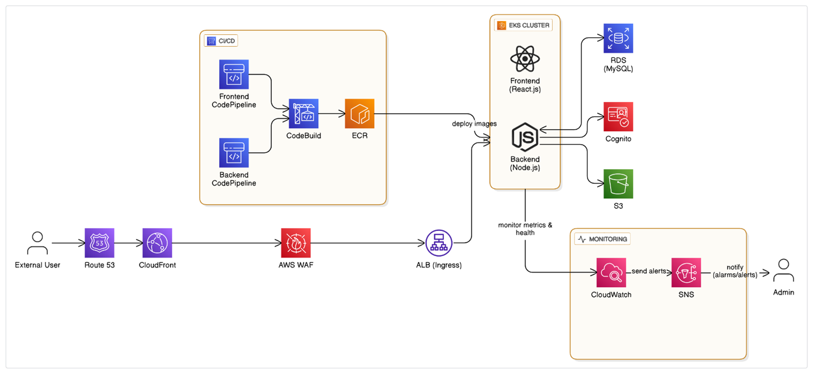

** E-Commerce Application CI/CD on AWS EKS **
A modern, cloud-native e-commerce web application with a fully automated CI/CD pipeline, deployed on AWS using Kubernetes (EKS), CodePipeline, and other managed services.

🚀 Project Overview
This project demonstrates how to build, containerize, and deploy a scalable e-commerce application using AWS DevOps tools and Kubernetes. It automates every step from code commit to deployment, ensuring reliability, security, and observability.

🏗️ Architecture

📚 Resources
[AWS EKS Documentation](https://docs.aws.amazon.com/eks/)

[AWS CodePipeline Documentation](https://docs.aws.amazon.com/codepipeline/)

[Kubernetes Documentation](https://kubernetes.io/docs/home/)

📝 Key Features
* Automated CI/CD with AWS CodePipeline and CodeBuild

* Containerized frontend and backend (React.js & Node.js) on EKS

* Secure, scalable infrastructure via CloudFormation

* Managed authentication (Cognito) and asset storage (S3)

* Monitoring and alerting with CloudWatch and SNS

🙋‍♀️ Author
Heena

Feel free to fork, contribute, or reach out for questions!